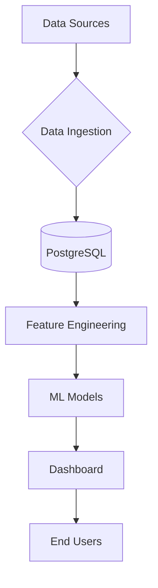

# System Architecture

```mermaid
graph TD
    A[Data Sources] --> B{Data Ingestion}
    B --> C[(PostgreSQL)]
    C --> D[Feature Engineering]
    D --> E[ML Models]
    E --> F[Dashboard]
    F --> G[End Users]
```
